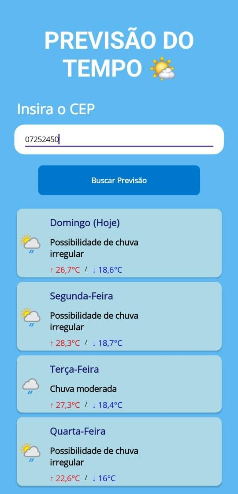

# Previsão do Tempo - Projeto PAM (Mobile)

Este projeto foi desenvolvido como parte da matéria **PAM (Programação Mobile)** da escola, utilizando **C#** e **.NET MAUI** para criar um aplicativo mobile que exibe a previsão do tempo.

---

## Tecnologias utilizadas

- **C#**  
- **.NET MAUI**  
- **Weather API** (https://www.weatherapi.com/)  
- **Brasil API** (https://brasilapi.com.br/)  

---

## Como abrir o projeto

1. Certifique-se de ter instalado o **Visual Studio 2022 ou 2023** com a carga de trabalho **.NET MAUI**.  
2. Clone este repositório:  

```bash

git clone <URL_DO_REPOSITORIO>
```
3. Abra a solução .sln no Visual Studio.
4. Restaure os pacotes NuGet se necessário.
5. Execute o projeto em um emulador ou dispositivo físico Android/iOS.

## Configuração da Weather API

Para que o aplicativo funcione corretamente, você precisa de uma chave de API da Weather API:

Acesse Weather API (https://www.weatherapi.com/)

Crie uma conta gratuita e obtenha sua chave (API Key).

No projeto, abra o arquivo WeatherApiService.cs e substitua a variável apiKey pela sua chave:

```bash

private readonly string apiKey = "SUA_CHAVE_AQUI";

```

## Imagens do Aplicativo em Funcionamento


